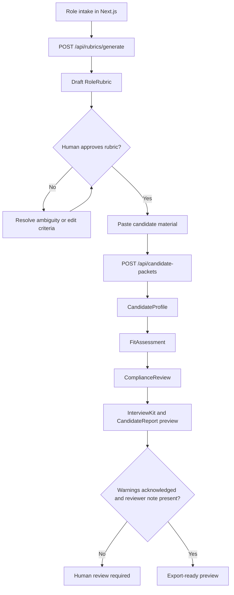

# Recruitment Assistant

Human-in-the-loop recruitment support powered by a CrewAI-oriented multi-agent workflow.

Recruitment Assistant helps recruiters and hiring managers turn job descriptions and candidate materials into structured, evidence-linked candidate packets. The application generates an editable role rubric, requires human approval before candidate assessment, summarizes pasted candidate material, compares evidence against approved criteria, surfaces compliance warnings, and prepares a reviewable report preview.

The product is decision-support software. It must not autonomously reject candidates, finalize hiring decisions, rank candidates, or send candidate-facing communications without explicit human confirmation.

## Current Status

Build phase complete for the MVP local application.

- Define artifacts are present: MRD, PRD, and SAD.
- Build artifacts are present: setup, frontend, backend, integration, and QA reports.
- Backend MVP is implemented with FastAPI, CrewAI-compatible orchestration, Pydantic schemas, and guardrails.
- Frontend MVP is implemented with Next.js App Router and TypeScript.
- Frontend/backend integration is implemented for rubric generation and candidate packet generation.
- QA smoke validation passed with caveats documented in `project-context/2.build/qa.md`.

Deferred beyond the current MVP: authentication, persistence, async job queue, PDF/DOCX parsing, ATS integrations, backend export downloads, retention/deletion workflows, and production deployment packaging.

## How To Run The Application

Run the backend and frontend in separate terminals from the repository root.

### 1. Configure Environment

```bash
cp .env.example .env
export AAMAD_TARGET_RUNTIME=crewai
```

Optional provider settings are available in `.env.example`. If model-provider credentials are not configured, the backend can still return conservative fallback artifacts for local smoke testing.

### 2. Start The Backend

```bash
pip install -r src/backend/requirements.txt
PYTHONPATH=src/backend uvicorn app.main:app --reload
```

The API starts at `http://127.0.0.1:8000`.

Health check:

```bash
curl http://127.0.0.1:8000/api/health
```

Expected response:

```json
{"status":"ok","runtime":"crewai"}
```

### 3. Start The Frontend

```bash
cd src/frontend
corepack npm install
NEXT_PUBLIC_API_BASE_URL=http://127.0.0.1:8000 corepack npm run dev
```

Open `http://127.0.0.1:3000`.

## Environment Setup Instructions

The selected AAMAD runtime is CrewAI:

```bash
export AAMAD_TARGET_RUNTIME=crewai
```

Local environment files should include:

```env
AAMAD_TARGET_RUNTIME=crewai
CREWAI_TELEMETRY_OPT_OUT=true
MODEL_PROVIDER=openai
MODEL_API_KEY=
MODEL_BASE_URL=
MODEL_NAME=gpt-4o-mini
NEXT_PUBLIC_API_BASE_URL=http://127.0.0.1:8000
```

Backend dependencies are defined in `src/backend/requirements.txt`. Frontend dependencies are defined in `src/frontend/package.json`.

Known local tooling note: in this WSL workspace, `corepack npm` is the working npm entry point used by the Build artifacts.

## Architecture Overview

The MVP is a two-service application:

- **Frontend:** Next.js App Router with TypeScript in `src/frontend`. It provides role intake, rubric approval, candidate text submission, candidate packet review, compliance warning acknowledgement, and report preview controls.
- **Backend:** FastAPI in `src/backend/app`. It exposes JSON endpoints for health, rubric generation, and candidate packet generation.
- **Agent runtime:** CrewAI-compatible recruitment crew in `src/backend/app/crews/recruitment`, with agent and task definitions externalized to YAML config files.
- **Schemas and guardrails:** Pydantic models and guardrail helpers validate structured outputs, block final-decision language, and enforce approved-rubric gating.

Core API endpoints:

| Method | Path | Purpose |
|---|---|---|
| `GET` | `/api/health` | Returns service status and resolved runtime |
| `POST` | `/api/rubrics/generate` | Creates a draft role rubric from role details and job description |
| `POST` | `/api/candidate-packets` | Creates an evidence-linked candidate packet from an approved rubric and candidate material |

High-level flow:



## Validation

Run the AAMAD Build gate from the repository root:

```bash
aamad validate --phase build
```

Run backend and frontend checks separately:

```bash
PYTHONPATH=src/backend python -m compileall src/backend/app
cd src/frontend
corepack npm run lint
corepack npm run build
```

## Project Structure

```text
.
├── project-context/
│   ├── 1.define/          # MRD, PRD, SAD
│   ├── 2.build/           # Setup, frontend, backend, integration, QA artifacts
│   └── 3.deliver/         # Deployment and user-guide artifacts, pending
├── src/
│   ├── backend/           # FastAPI + CrewAI-compatible backend
│   └── frontend/          # Next.js App Router frontend
├── .env.example           # Local environment template
├── AGENTS.md              # AAMAD agent framework overview
├── CHECKLIST.md           # AAMAD workflow checklist
└── README.md
```
