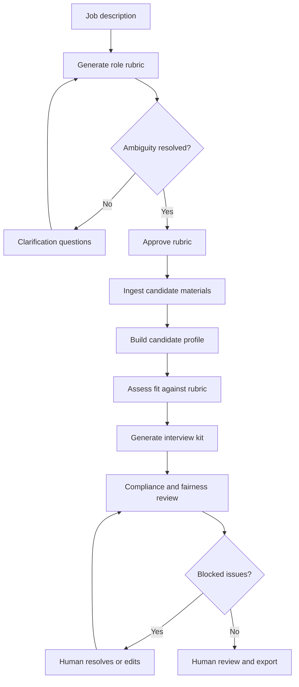

# Recruitment Assistant

Human-in-the-loop recruitment support powered by a CrewAI-style multi-agent workflow.

## Project Overview

Recruitment Assistant helps recruiters and hiring managers turn job descriptions and candidate materials into structured, evidence-linked candidate packets. The application is designed to analyze role requirements, create an editable hiring rubric, summarize candidate resumes, compare candidates against approved criteria, generate interview preparation material, and produce auditable reports for human review.

The product is intentionally positioned as decision-support software. It must not autonomously reject candidates, finalize hiring decisions, or send candidate-facing communications without explicit human confirmation.

This repository follows the AAMAD workflow:

- `project-context/1.define/` contains market and product definition artifacts.
- `project-context/2.build/` will contain setup and build-phase artifacts.
- `project-context/3.deliver/` will contain deployment and user-guide artifacts.

Current target runtime: `crewai`.

## Problem Statement And Value Proposition

Recruiting teams spend substantial time reviewing resumes, interpreting role requirements, preparing interview questions, and documenting candidate decisions. These workflows are repetitive, inconsistent across reviewers, and increasingly sensitive from a compliance, privacy, and fairness perspective.

Recruitment Assistant addresses this by providing a structured AI workflow that:

- Reduces manual candidate review effort and targets at least 4 recruiter hours saved per recruiter per week during pilot use.
- Improves consistency by requiring candidates to be evaluated against a recruiter-approved role rubric.
- Increases trust by linking claims and recommendations back to source evidence.
- Surfaces ambiguity in job requirements before candidate assessment begins.
- Supports human oversight, auditability, and compliance review for employment-related AI use.

## Key Features

- **Role intake and rubric generation:** Convert job descriptions into structured hiring rubrics with must-have criteria, nice-to-have criteria, responsibilities, seniority, constraints, and excluded criteria.
- **Ambiguity handling:** Detect vague, missing, or contradictory job requirements and block candidate assessment when high-severity ambiguity remains unresolved.
- **Candidate ingestion:** Accept resumes/CVs or pasted profile text and extract structured candidate profiles with source evidence.
- **Evidence-linked assessment:** Compare candidate profiles against the approved rubric with criterion-level rationale, confidence, strengths, gaps, and missing evidence.
- **Compliance and fairness review:** Flag unsupported claims, protected/proxy attribute concerns, prohibited criteria, overconfident language, and prompt-injection attempts in candidate documents.
- **Interview preparation:** Generate candidate-specific interview questions tied to rubric criteria, strengths, gaps, and missing evidence.
- **Human review controls:** Require human confirmation before shortlist/report export and keep human edits distinct from generated content.
- **Audit package:** Preserve role rubric version, source references, agent run metadata, warnings, edits, reviewer identity, and export history.
- **Operational metrics:** Track recruiter time saved, hours saved per week, unsupported-claim rate, agent run failure rate, correction rate, and audit completeness.

## Application Architecture Overview

The planned application uses CrewAI to orchestrate specialized agents through a controlled, sequential workflow. Each agent owns a focused task and produces structured outputs that can be reviewed, corrected, and audited.

| Agent | Role | Primary output |
|---|---|---|
| Job Requirements Analyst | Converts job descriptions into structured rubrics, detects ambiguity, and generates clarification prompts. | `RoleRubric` |
| Candidate Profiler | Parses and normalizes candidate materials, extracts evidence snippets, and identifies missing information. | `CandidateProfile` |
| Candidate Fit Assessor | Compares candidates to the approved rubric and produces criterion-level fit analysis. | `FitAssessment` |
| Interview Prep Specialist | Generates role-specific and candidate-specific interview questions. | `InterviewKit` |
| Compliance & Fairness Reviewer | Checks outputs for unsupported claims, prohibited criteria, protected-attribute concerns, and prompt-injection risks. | `ComplianceReview` |
| Hiring Report Writer | Compiles the reviewed candidate packet, warnings, interview kit, and human decision fields. | `CandidateReport` |

### High-Level Workflow



## Getting Started

This repository is currently in the AAMAD Define phase. The PRD exists, and the SAD is still pending. Build-phase setup should wait for the SAD so the project manager can create the structure without guessing architecture decisions.

### Prerequisites

- Linux, macOS, or Windows with a POSIX-compatible shell for the documented commands.
- Python 3 environment for the AAMAD CLI already present in `.venv/`.
- Access to VS Code + GitHub Copilot agent files in `.github/agents/` if using the configured agent workflow.

### Validate Current Artifacts

From the repository root:

```bash
.venv/bin/aamad validate
```

At the time of writing, validation is expected to fail until `project-context/1.define/sad.md` is created:

```text
[ERROR] project-context/1.define/sad.md: Required Define artifact missing
```

### Define-Phase Artifacts

Review the current product definition documents:

- `project-context/1.define/mrd.md`
- `project-context/1.define/prd.md`

The next required Define artifact is:

- `project-context/1.define/sad.md`

### Build-Phase Setup

After the SAD is created, run the Project Manager workflow to scaffold only the approved project structure, dependencies, environment examples, and setup documentation:

```text
@project.mgr *setup-project
@project.mgr *install-dependencies
@project.mgr *configure-env
@project.mgr *document-setup
```

The Project Manager persona must not create backend, frontend, integration, or business-logic code.

## Project Structure

```text
.
├── .cursor/
│   ├── agents/              # Cursor-format AAMAD agent definitions
│   └── templates/           # Shared MRD, PRD, SAD, and related templates
├── .github/
│   ├── agents/              # VS Code / GitHub Copilot agent definitions
│   ├── instructions/        # Copilot custom instructions
│   └── prompts/             # Phase and workflow prompts
├── .vscode/
│   └── settings.json        # Copilot agent discovery settings
├── project-context/
│   ├── 1.define/
│   │   ├── mrd.md           # Market requirements document
│   │   └── prd.md           # Product requirements document
│   ├── 2.build/             # Build setup and implementation artifacts
│   └── 3.deliver/           # Deployment and user-guide artifacts
├── AGENTS.md                # AAMAD agent framework overview
├── CHECKLIST.md             # AAMAD workflow checklist
├── aamad.config.example.yml # Example AAMAD configuration
└── README.md                # Project overview and contributor guide
```

## Next Steps For Contributors

1. **System Architect:** Create `project-context/1.define/sad.md` from the PRD, including runtime architecture, data model, security posture, CrewAI project layout, and deployment assumptions.
2. **Project Manager:** After SAD approval, scaffold the root project structure, install only approved dependencies, configure `.env.example` files, and write `project-context/2.build/setup.md`.
3. **Backend Engineer:** Implement the CrewAI runtime backend only after setup and SAD are available.
4. **Frontend Engineer:** Build the MVP review interface for roles, candidates, compliance warnings, interview kits, and exports.
5. **Integration Engineer:** Connect frontend and backend workflows, including job processing status and report export.
6. **QA Engineer:** Validate role-rubric approval, ambiguity blocking, candidate packet generation, compliance guardrails, and audit package completeness.
7. **Security Engineer:** Assess candidate-data handling, role-based access control, logging minimization, prompt-injection defenses, retention, and export auditing.
8. **DevOps Engineer:** Prepare deployment documentation, runtime configuration, operational runbook, and user guide.

## Current Status

- MRD: complete draft.
- PRD: complete draft with ambiguity handling and recruiter time-savings metrics.
- SAD: pending.
- Build setup: pending SAD.
- Application code: not yet scaffolded.
