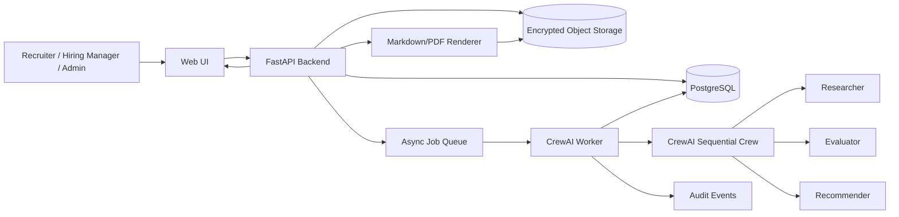

# System Architecture Document (SAD): Recruitment Assistant

**Product:** Recruitment Assistant Application  
**Phase:** AAMAD Define  
**Primary persona:** System Architect (`system-arch`)  
**Requested workflow:** `*create-sad`  
**Upstream artifacts:** `project-context/1.define/prd.md`, `project-context/1.define/mrd.md`  
**Template:** `.cursor/templates/sad-template.md`  
**Selected runtime:** CrewAI (`crewai`)  
**Date:** 2026-09-23  
**Status:** Draft v0.1 for stakeholder review

---

## Context & Instructions

This SAD defines the MVP architecture for a human-in-the-loop recruitment assistant that converts role requirements and candidate materials into structured, evidence-linked candidate packets, interview kits, compliance warnings, and exportable reports. The architecture is grounded in the PRD and MRD and does not introduce autonomous hiring decisions, unsupervised sourcing, ATS write-back, or candidate outreach beyond the documented scope.

The system uses CrewAI as the selected multi-agent orchestration runtime. Crew execution is backend-owned, auditable, schema-constrained, and gated by recruiter/hiring-manager approval points described in the PRD.

## Input Requirements

**PRD Document**: `project-context/1.define/prd.md`  
**MRD**: `project-context/1.define/mrd.md`  
**User Stories**: N/A; no `project-context/1.define/user-stories/` artifacts are present at SAD creation time.  
**MVP Scope**: Role intake, rubric generation and approval, candidate ingestion, evidence-linked candidate profiling, rubric-based fit assessment, interview kit generation, compliance review, human review, audit package, and Markdown/PDF report export.  
**Selected Runtime**: `crewai`

---

## 1. MVP Architecture Philosophy & Principles

### MVP Design Principles

- **Decision support only:** The system provides recruiter-facing recommendations and preparation materials, but never automatically rejects, hires, advances, ranks, or contacts candidates. This traces to PRD Executive Summary, PRD Non-goals, FR-013, and FR-020.
- **Rubric-first evaluation:** Candidate assessment is blocked until a recruiter or hiring manager approves a role rubric. This traces to PRD FR-003, FR-011, FR-032, and FR-033.
- **Evidence-first output:** Every substantive candidate claim must include a source reference or be flagged, downgraded, or removed. This traces to PRD FR-008, FR-012, FR-017, and NFR-017.
- **Human oversight by design:** Export requires reviewer identity, human decision note, compliance status, and warning acknowledgement where applicable. This traces to PRD FR-016, FR-020, FR-021, NFR-015, and NFR-018.
- **Minimal viable agent set:** The MVP consolidates the PRD's six proposed CrewAI agents into four execution agents to reduce orchestration complexity while preserving required responsibilities.
- **Auditable and reproducible runs:** Agent definitions, task schemas, model/provider settings, input references, output versions, warnings, human edits, and exports are persisted for review. This traces to PRD FR-004, FR-021, NFR-010, and NFR-016.
- **Privacy-sensitive defaults:** Candidate data is high-risk personal data; storage, logs, and exports minimize sensitive content and support deletion and retention controls. This traces to PRD NFR-001 through NFR-009.

### Core vs Future Features

**MVP**

- Web UI for role intake, rubric approval, candidate upload/paste, packet review, compliance warnings, interview kit editing, and report export.
- FastAPI backend for authenticated API requests, validation, persistence, file handling, report rendering, audit logging, and CrewAI invocation.
- CrewAI sequential crew for role analysis and candidate packet generation.
- Structured output schemas for `RoleRubric`, `CandidateProfile`, `FitAssessment`, `ComplianceReview`, `InterviewKit`, and `CandidateReport`.
- Minimal document extraction for plain text plus PDF/DOCX where parser support is available.
- Markdown export as required MVP capability; PDF export should be included if renderer setup is available in Build phase, otherwise implemented as a near-MVP follow-up while preserving architecture hooks.

**Future**

- ATS integrations with Greenhouse, Lever, Ashby, Workday, BambooHR, or similar systems.
- Automated candidate communication workflows.
- Adverse-impact dashboards and jurisdiction-specific compliance workflows.
- Multi-tenant SaaS hardening, SSO, advanced policy management, and enterprise retention rules.
- Rich model/vendor abstraction, advanced APM, cost optimization, horizontal scaling, and queue worker autoscaling.
- Numeric scoring, if approved, behind an explicit feature flag and compliance review.

**Explicit exclusions and deferrals**

- No autonomous rejection, final hiring decision, or hidden auto-rank behavior in MVP.
- No unsupervised web scraping, social media sourcing, or unauthorized public profile ingestion.
- No ATS write-back automation.
- No candidate outreach automation.
- No legal determination of compliance; the product supports compliance review and auditability but does not replace legal counsel.

### Technical Architecture Decisions

| Decision | Selected approach | Rationale | Source traceability |
|---|---|---|---|
| Runtime | CrewAI sequential process | PRD selects CrewAI and recommends sequential MVP orchestration unless a later need justifies hierarchy. | PRD 3.1, PRD 8.3, MRD 3 |
| Backend framework | FastAPI | Strong fit for typed request/response schemas, async job endpoints, OpenAPI documentation, and Python-native CrewAI integration. | PRD 3.1, PRD NFR-010, user request |
| Frontend | Simple responsive web UI | PRD defines multiple review screens and non-blocking processing status; a web UI is more suitable than CLI for human review, evidence panels, and export controls. | PRD 6.1, PRD 6.2, user request |
| Persistence | Minimal application database plus object storage | Required for rubric versions, corrections, audit packages, deletion, retention, and exported reports. | PRD FR-004, FR-021, NFR-006, NFR-018 |
| Async execution | Backend job queue for candidate packet generation | Candidate processing can take minutes and must not block navigation. | PRD NFR-011, NFR-014 |
| Streaming | Status-event streaming optional; final outputs non-streaming and schema-validated | MVP needs progress visibility and reliable structured artifacts more than token-by-token output. | PRD 6.2, NFR-010, NFR-014 |
| Fit labels | Categorical labels only | PRD forbids final decision labels and defines allowed categorical values. | PRD 3.4, FR-013 |

---

## 2. Multi-Agent System Specification

### Agent Architecture Requirements

The MVP uses four specialized CrewAI agents. This keeps the crew within the template's 3-4 agent guidance while covering the PRD's six proposed responsibilities.

| MVP agent | Consolidated PRD roles | Goal | Primary outputs | Tool access |
|---|---|---|---|---|
| Researcher | Job Requirements Analyst, Candidate Profiler | Extract structured role criteria and candidate evidence from user-provided sources. | `RoleRubric`, `CandidateProfile`, evidence map, ambiguity warnings | Read-only access to uploaded text/extracted document content; no web browsing by default |
| Evaluator | Candidate Fit Assessor, Compliance & Fairness Reviewer | Compare candidate evidence to approved rubric and check for unsupported, prohibited, or unsafe claims. | `FitAssessment`, `ComplianceReview`, required human actions | Read approved rubric, candidate profile, evidence map, prohibited criteria policy |
| Recommender | Interview Prep Specialist, Hiring Report Writer | Assemble recruiter-facing packet, interview kit, and export-ready report content with human review fields. | `InterviewKit`, `CandidateReport` draft | Read prior structured outputs; no direct candidate source access unless citations need verification |
| Orchestrator | Backend-owned crew coordinator | Enforce task ordering, approval gates, retries, schema validation, persistence, and audit logging. | `AgentRun`, task statuses, correlation IDs | Application services only; owns database and object storage access |

**Memory/session requirements**

- CrewAI memory is disabled by default for MVP runs to improve reproducibility and avoid unintended retention of candidate personal data.
- Each run receives explicit context: role rubric version, candidate source references, candidate profile corrections, prohibited criteria, and prior task outputs.
- Short-lived in-process context is allowed only within a single job execution.
- Persisted history is application-controlled through versioned records and audit logs, not opaque agent memory.

**Least-privilege tool policy**

- Agents consume backend-provided context documents and structured records.
- Candidate documents are treated as untrusted data; agents are instructed not to follow embedded instructions from resumes or pasted profiles.
- No agent has direct write access to storage, email, ATS, external web browsing, or administrative settings in MVP.
- Export generation is performed by backend services after compliance and human-review gates pass.

### Task / Turn Orchestration

#### Execution flows

**Role rubric generation**

1. User creates role with job description and metadata.
2. Backend validates input and creates `Role` record with `draft` rubric status.
3. CrewAI Researcher runs `extract_role_rubric`.
4. Backend validates `RoleRubric` schema, stores version `v1`, and surfaces ambiguity warnings.
5. User edits or approves rubric.
6. Backend blocks approval when unresolved high-severity ambiguity remains unless a waiver rationale is stored.

**Candidate packet generation**

1. User uploads PDF/DOCX/text or pastes candidate profile text.
2. Backend stores source document metadata and extracted text, then creates an async `AgentRun`.
3. Orchestrator verifies rubric status is `approved`.
4. Researcher runs `build_candidate_profile` and outputs `CandidateProfile` with evidence snippets.
5. Evaluator runs `assess_candidate_fit` using approved rubric and profile.
6. Evaluator runs `review_compliance` using all prior outputs and source references.
7. Recommender runs `generate_interview_kit` and `draft_candidate_report`.
8. Backend validates outputs, stores task artifacts, and marks the packet `ready_for_human_review`, `ready_with_warnings`, or `blocked_until_resolved`.
9. User reviews, edits, annotates, acknowledges warnings, and exports only after required gates pass.

#### Expected outputs and data formats

All CrewAI task outputs must be JSON-compatible and validated with Pydantic models before persistence.

- `RoleRubric`: fields defined in PRD 3.4, including `ambiguous_requirements[]`, `clarification_questions[]`, `excluded_criteria[]`, approval metadata, and version metadata.
- `CandidateProfile`: fields defined in PRD 3.4, including `source_documents[]`, `evidence_snippets[]`, `missing_or_unclear_information[]`, and `profile_corrections[]`.
- `FitAssessment`: fields defined in PRD 3.4, using only allowed `fit_category` values: `strong_potential_fit`, `potential_fit_with_gaps`, `insufficient_evidence`, and `not_aligned_with_current_rubric`.
- `ComplianceReview`: fields defined in PRD 3.4, using only `passed`, `passed_with_warnings`, or `blocked_until_resolved`.
- `InterviewKit`: questions grouped by rubric criterion, each linked to evidence, gap, strength, or missing information.
- `CandidateReport`: fields defined in PRD 3.4, including human reviewer fields that remain unset until user confirmation.

#### Context passing between agents

- Researcher receives role source text and outputs a rubric; candidate profile generation may optionally receive approved rubric to focus evidence extraction.
- Evaluator receives only approved rubric, candidate profile, evidence map, corrections, and excluded criteria.
- Compliance review receives full generated outputs plus evidence references, not raw tool permissions.
- Recommender receives validated assessment and compliance results; blocked compliance status prevents export-ready report finalization.

#### Error handling, retries, cancellation, and timeout behavior

- Each `AgentRun` has `queued`, `running`, `needs_human_input`, `failed`, `ready_for_review`, `blocked_until_resolved`, and `completed` states.
- Each task stores `status`, `started_at`, `completed_at`, `duration_ms`, `retry_count`, `error_code`, `error_message`, and `correlation_id`.
- Retry transient model/provider errors up to 2 times with exponential backoff.
- Do not retry validation failures that indicate schema mismatch, prohibited labels, missing required evidence, unresolved rubric ambiguity, or blocked compliance status; surface them to the user/admin.
- User cancellation marks the run `cancelled`; backend stops scheduling downstream tasks and records partial artifacts as non-exportable.
- Default timeout targets: 60 seconds for rubric generation, 120 seconds for candidate profile, 90 seconds for fit assessment, 60 seconds for compliance review, 60 seconds for report/interview draft. Overall target remains under 3 minutes per typical candidate packet where feasible, matching PRD NFR-013.

#### Performance budgets

- Single candidate packet: target median under 3 minutes during pilot.
- Role rubric generation: target under 90 seconds for typical job description.
- Concurrent pilot workload: 2-5 active users and up to 10 queued candidate jobs without UI blocking.
- Token/cost controls: truncate or chunk long source documents, cap task iterations, require structured outputs, log estimated token/cost per task, and reject files above configured size limits.

### Runtime-Conditional Configuration

#### crewai

**Crew composition**

- `researcher`: owns rubric extraction and candidate profile normalization.
- `evaluator`: owns rubric-based assessment and compliance/fairness review.
- `recommender`: owns interview-kit creation and candidate-report drafting.

**Process type**

- Use `Process.sequential` for MVP.
- Do not use hierarchical delegation for MVP unless later QA shows sequential orchestration cannot satisfy the workflow.

**YAML agent/task configuration**

- Store agent definitions in backend configuration files, for example `backend/app/crews/recruitment/agents.yaml`.
- Store task definitions in `backend/app/crews/recruitment/tasks.yaml`.
- Version these files as product-controlled technical documentation, satisfying PRD NFR-016.

**Recommended agent config constraints**

- `allow_delegation: false` for all MVP agents.
- `memory: false` unless explicitly approved by security and privacy review.
- `verbose: true` only in development; production logs must exclude full candidate text unless secure audit storage is enabled.
- Use model/provider settings only from admin-managed environment/config records.

**Recommended task config constraints**

- Assign each task to one agent with explicit `expected_output` and Pydantic `output_json` or equivalent schema validation.
- Use CrewAI task context chaining so downstream tasks receive only validated upstream outputs.
- Set `human_input` for rubric approval and export confirmation gates at the application layer; CrewAI should not bypass these gates.
- Apply guardrails for prohibited final decision labels, missing citations, unsupported claims, protected/proxy attribute references, and prompt-injection instructions embedded in candidate documents.

**`max_iter` and limits**

- Researcher: `max_iter` 2-3 per task.
- Evaluator: `max_iter` 2-3 per task.
- Recommender: `max_iter` 2 per task.
- Any task exceeding limits returns a recoverable failure or partial draft marked as non-exportable until reviewed.

---

## 3. Frontend Architecture Specification

### Technology Stack

- **Framework:** Next.js App Router with TypeScript, selected as a pragmatic default for a modern responsive web UI and future deploy flexibility.
- **UI approach:** Component-based product UI with accessible forms, tables, tabs, panels, progress indicators, warning states, and report preview.
- **Styling:** CSS modules, Tailwind CSS, or a lightweight design-system layer may be selected in Build phase; no vendor UI library is mandatory from this SAD.
- **State management:** Server data via typed API client and local component state for form drafts. Avoid global state unless cross-screen workflow state requires it.
- **Type safety:** Shared OpenAPI-generated or manually shared TypeScript types derived from backend Pydantic schemas.

### Application Structure

| Route | Purpose | Key requirements |
|---|---|---|
| `/roles` | List roles and approval status | Create role, view rubric status, filter active roles |
| `/roles/new` | Role intake | Job description upload/paste, metadata fields, generate rubric action |
| `/roles/[roleId]/rubric` | Rubric editor | Edit criteria, resolve ambiguity, approve rubric, view version history |
| `/roles/[roleId]/candidates` | Candidate queue | Upload/paste candidate materials, processing status, parser warnings, batch actions |
| `/candidates/[candidateId]/packet` | Candidate packet | Evidence-linked summary, criterion assessment, strengths/gaps, corrections, override annotations |
| `/candidates/[candidateId]/compliance` | Compliance review | Unsupported claims, protected/proxy warnings, prompt-injection flags, required human actions |
| `/candidates/[candidateId]/interview-kit` | Interview preparation | Questions grouped by criterion, edit controls, warning state |
| `/reports/[reportId]` | Report preview/export | AI vs human edit markers, reviewer identity, decision note, export action, audit link |
| `/audit` | Audit retrieval | Search by role, candidate, report, run ID, export event |
| `/admin` | Admin settings | Retention, deletion, user roles, model/provider settings |

**API client boundaries**

- Frontend calls typed backend endpoints only.
- Frontend must not import CrewAI code, access model-provider secrets, parse uploaded files directly for authoritative extraction, or perform compliance decisions locally.
- Long-running job status is read through `/agent-runs/{run_id}` or server-sent events if implemented.

**Component architecture and accessibility**

- Use dedicated components for `RoleRubricEditor`, `AmbiguityResolver`, `CandidateUploadQueue`, `EvidencePanel`, `CriterionAssessmentTable`, `ComplianceWarningPanel`, `InterviewKitEditor`, `ReportPreview`, and `AuditTimeline`.
- Meet WCAG-oriented basics: keyboard navigation, visible focus states, semantic forms/tables, screen-reader labels for warnings, and non-color-only status indicators.
- Keep AI-generated content visually distinct from human edits and final human notes, satisfying PRD FR-028.

### Interface Requirements

- Primary interaction surface is a task-oriented web UI, not a generic chat-first interface, because the PRD specifies structured screens and approval gates.
- Chat-style assistance may be added as a future enhancement for rubric clarification or report editing, but the MVP workflow should remain form/review driven.
- All long-running operations show queued/running/failed/ready states, correlation ID, and retry affordance when permitted.
- Candidate assessment controls remain disabled until rubric status is `approved`.
- Export controls remain disabled until compliance status is not `blocked_until_resolved` and reviewer identity plus decision note are present.
- Placeholders for ATS integration, public profile import, advanced analytics, and candidate disclosure workflows should be non-functional or hidden behind disabled feature flags unless explicitly scoped later.

---

## 4. Backend Architecture Specification

### API Architecture

FastAPI is the selected backend API framework for the MVP. Flask is not used in the target architecture. FastAPI owns authentication, validation, persistence, file extraction, job scheduling, CrewAI invocation, audit logging, and export generation.

#### Primary REST endpoints

| Method | Path | Purpose |
|---|---|---|
| `POST` | `/api/roles` | Create role with job description and metadata |
| `POST` | `/api/roles/{role_id}/rubric/generate` | Start rubric generation run |
| `GET` | `/api/roles/{role_id}/rubric` | Retrieve current rubric and status |
| `PUT` | `/api/roles/{role_id}/rubric` | Save user edits and version history |
| `POST` | `/api/roles/{role_id}/rubric/approve` | Approve rubric when ambiguities are resolved or waived |
| `POST` | `/api/roles/{role_id}/candidates` | Upload or paste candidate material |
| `POST` | `/api/candidates/{candidate_id}/process` | Start candidate packet generation |
| `GET` | `/api/agent-runs/{run_id}` | Read async status, task states, and errors |
| `GET` | `/api/candidates/{candidate_id}/packet` | Retrieve generated packet and human edits |
| `PUT` | `/api/candidates/{candidate_id}/profile-corrections` | Save recruiter corrections |
| `PUT` | `/api/assessments/{assessment_id}/overrides` | Save human override or annotation |
| `PUT` | `/api/interview-kits/{kit_id}` | Save edited interview questions |
| `POST` | `/api/reports/{report_id}/review` | Record reviewer identity, note, and warning acknowledgement |
| `POST` | `/api/reports/{report_id}/export` | Export Markdown/PDF after gates pass |
| `GET` | `/api/audit/{entity_type}/{entity_id}` | Retrieve audit package/timeline |
| `GET` | `/api/health` | Health check for deployment and monitoring |

#### Example request and response contracts

**Start candidate processing request**

```json
{
  "role_rubric_id": "rub_123",
  "candidate_id": "cand_456",
  "include_interview_kit": true
}
```

**Start candidate processing response**

```json
{
  "run_id": "run_789",
  "status": "queued",
  "correlation_id": "corr_20260923_001"
}
```

**Error envelope**

```json
{
  "error": {
    "code": "RUBRIC_NOT_APPROVED",
    "message": "Candidate assessment requires an approved rubric.",
    "correlation_id": "corr_20260923_001",
    "details": {
      "role_id": "role_123",
      "rubric_status": "draft"
    }
  }
}
```

#### Validation, rate limiting, and response behavior

- Validate all inputs with Pydantic request models.
- Validate all CrewAI outputs with Pydantic response models before persistence.
- Reject prohibited fit labels such as `reject`, `hire`, `advance`, or equivalent final decision terms in structured fields.
- Enforce file type and file size limits for candidate uploads.
- Add per-user and per-tenant rate limits for upload, generation, and export endpoints.
- Use consistent error envelopes with machine-readable codes and correlation IDs.

### Data Architecture

The MVP requires persistence because the PRD mandates rubric version history, audit packages, reviewer identity, retention/deletion, and export history. Use PostgreSQL for structured application data and local/S3-compatible object storage for source documents and exports.

#### Core entities

| Entity | Purpose | Key relationships |
|---|---|---|
| `User` | Recruiter, hiring manager, admin, auditor identity | Owns edits, approvals, exports, audit events |
| `Role` | Job requisition/intake record | Has many rubric versions and candidates |
| `RoleRubricVersion` | Versioned approved/draft rubric | Belongs to role; used by assessments |
| `Candidate` | Candidate container with minimal metadata | Belongs to role or workspace; has source documents |
| `SourceDocument` | Uploaded/pasted source metadata and storage pointer | Belongs to candidate; includes origin, uploader, purpose |
| `CandidateProfileVersion` | Structured profile and corrections | Belongs to candidate and source document set |
| `FitAssessment` | Rubric-based assessment | References candidate profile and rubric version |
| `ComplianceReview` | Guardrail results and required actions | References assessment/report artifacts |
| `InterviewKit` | Interview questions and edits | References assessment/profile/rubric |
| `CandidateReport` | Exportable report draft/final state | References all prior outputs and reviewer fields |
| `AgentRun` | Crew/job execution metadata | Has many task runs; references role/candidate/report |
| `AuditEvent` | Immutable event log | References actor, entity, action, timestamp, correlation ID |
| `AdminSetting` | Retention/model/provider settings | Scoped to workspace/tenant |

#### Storage and retention

- Store source document binaries in encrypted object storage.
- Store extracted text only as needed for evidence traceability and audit; redact or minimize logs.
- Store report exports as immutable objects with audit metadata.
- Implement deletion workflows that remove candidate source documents and derived records according to retention policy and legal hold constraints.

### Runtime Integration Layer

- FastAPI enqueues an `AgentRun` through a worker process such as Celery/RQ/Arq, selected in Build phase.
- Worker loads CrewAI agent/task YAML, resolves allowed model provider configuration, constructs validated task inputs, and calls `crew.kickoff()` for the relevant flow.
- Runtime adapter captures task start/end, output validation results, prompt/config version, model/provider identifier, latency, token/cost estimate, warnings, and errors.
- Backend stores each validated artifact separately so human edits can be compared against generated content.
- Prompt trace logs must use redaction/minimization by default and include full candidate text only in a protected audit store when explicitly configured.

### Authentication & Secrets

Authentication should use a simple MVP-compatible mechanism that can evolve to enterprise SSO. If no identity provider is selected, use session-based auth or JWT auth with locally managed users for the pilot, then replace with OIDC/SAML later.

Secrets and configuration are env-var driven. Names only:

- `AAMAD_TARGET_RUNTIME=crewai`
- `DATABASE_URL`
- `OBJECT_STORAGE_ENDPOINT`
- `OBJECT_STORAGE_BUCKET`
- `OBJECT_STORAGE_ACCESS_KEY_ID`
- `OBJECT_STORAGE_SECRET_ACCESS_KEY`
- `OBJECT_STORAGE_KMS_KEY_ID`
- `MODEL_PROVIDER`
- `MODEL_API_KEY`
- `MODEL_BASE_URL`
- `MODEL_NAME`
- `SECRET_KEY`
- `JWT_SIGNING_KEY`
- `CORS_ALLOWED_ORIGINS`
- `LOG_LEVEL`
- `MAX_UPLOAD_MB`
- `RETENTION_DEFAULT_DAYS`
- `ENABLE_PDF_EXPORT`

No secret values may be committed to project artifacts.

---

## 5. DevOps & Deployment Architecture

### CI/CD

Minimal MVP pipeline:

- Backend lint and format checks.
- Backend unit tests for schemas, guardrails, services, and API route validation.
- Backend integration tests for role/rubric generation, candidate processing, compliance blocking, export blocking, and audit package retrieval.
- Frontend typecheck, lint, and component/unit tests.
- Build smoke test for frontend and backend container images.
- Security checks for dependency vulnerabilities and accidental secret patterns.

### Hosting

- MVP hosting target: single-region container deployment with one web container, one worker container, PostgreSQL, object storage, and optional Redis/queue broker.
- Local development target: Docker Compose or equivalent local services.
- Health endpoint: `/api/health` returns application status and dependency status without exposing secrets or candidate data.
- Readiness should verify database connectivity, object storage connectivity, and worker queue availability.

### IaC / multi-region / advanced monitoring

- Multi-region deployment, blue/green deployment, full infrastructure-as-code, enterprise SIEM integration, and advanced APM are Future Work unless required by pilot customers.
- MVP deployment documentation should still identify required services, env vars, backup expectations, and restore procedure.

### Observability

- Structured application logs with correlation IDs.
- Metrics: agent run success/failure, task latency, queue depth, cost estimate, guardrail warning counts, export counts, audit retrieval success, and deletion request completion time.
- Alerts: failed health check, worker queue backlog, repeated model-provider failures, export failure spikes, and blocked compliance review spikes.
- Logs must avoid full candidate/resume content by default, satisfying PRD NFR-004.

---

## 6. Data Flow & Integration Architecture

### Request/response path



### MVP integration points

- **Model provider:** Used by CrewAI through admin-approved provider configuration.
- **Document extraction:** Backend parser for PDF, DOCX, and plain text where parser support is available.
- **Object storage:** Candidate source documents, extracted source references, and exported reports.
- **Database:** Roles, rubrics, candidates, generated outputs, edits, audit events, retention settings, and run metadata.
- **Export renderer:** Markdown first; PDF when enabled.

### Deferred integration points

- ATS import/export and write-back.
- Email/calendar/candidate outreach.
- Public profile scraping or automated sourcing.
- External compliance/legal systems.
- Advanced analytics or adverse-impact dashboards.

### Error propagation and user-visible feedback

- Backend maps runtime errors into stable API error codes.
- UI shows human-readable status and required action without exposing raw prompts or sensitive stack traces.
- Compliance `blocked_until_resolved` prevents export and displays required human actions.
- Missing evidence and ambiguity warnings remain visible in packets and reports until resolved, acknowledged, or marked as intentionally retained.

---

## 7. Performance & Scalability Specifications

### MVP response-time and concurrency targets

- Interactive API reads/writes: target p95 under 500 ms excluding file upload and agent execution.
- File upload: target p95 under 10 seconds for files within configured size limits on pilot infrastructure.
- Role rubric generation: target under 90 seconds for typical job descriptions.
- Single candidate packet generation: target median under 3 minutes for typical resume and approved rubric.
- UI responsiveness: users can leave processing screens and return to completed results.
- Pilot concurrency: support 2-5 active recruiters and up to 10 queued candidate jobs.

### Scaling path deferred with rationale

- Horizontal worker autoscaling is deferred until pilot load and cost data justify it.
- Multi-tenant isolation is designed into data models but may run as single-tenant/project workspace for early MVP.
- Advanced caching is deferred because outputs must remain traceable to exact rubric, source, correction, prompt, and model versions.

### Token and cost controls

- Enforce source document size limits and chunking.
- Pass only task-relevant context to each agent.
- Use structured outputs to reduce repair/retry loops.
- Track token/cost estimates at task and candidate-packet levels.
- Cap retries and `max_iter` to prevent runaway runs.
- Store model/provider version with each run for later cost and quality analysis.

---

## 8. Security & Compliance Architecture

### AuthN/AuthZ for MVP

- Roles: recruiter, hiring manager, admin, auditor.
- Recruiters can create roles, upload candidates, edit generated packets, acknowledge warnings, and export reports for permitted roles.
- Hiring managers can review packets, edit interview kits, and add decision notes for permitted roles.
- Admins can manage users, retention, model/provider settings, and deletion policies.
- Auditors can retrieve audit packages and view immutable event history but should not alter candidate evaluations.
- Backend enforces all permissions; frontend visibility controls are advisory only.

### Encryption and input validation baselines

- TLS required in production.
- Encrypt candidate documents, extracted text, reports, and backups at rest.
- Validate file type, file size, MIME type, and parser output.
- Treat all candidate documents and pasted profiles as untrusted input.
- Sanitize prompt context so candidate-provided instructions cannot alter system/developer policies or tool access.
- Restrict exports to reports with required human review and compliant status.

### Compliance controls

- No generated field may contain final decision labels such as hire/reject.
- Fit assessment uses categorical fit labels from PRD only.
- Compliance review runs before report export.
- Protected/proxy attribute warnings include detected source, risk type, and required human action.
- Unsupported claims are removed, downgraded, or flagged with missing evidence warnings.
- Audit package includes inputs, rubric version, source references, run metadata, warnings, edits, exports, reviewer identity, and human decision note.
- Admin retention/deletion workflows cover source documents, derived outputs, logs, and exports.

### Compliance deferred with Open Questions

- Jurisdiction-specific policy rules are deferred pending launch jurisdiction selection.
- Candidate-facing disclosure language is deferred pending legal/compliance guidance.
- Dual-review, adverse-impact analysis, formal DPIA/FRA workflows, and legal holds are Future Work unless required before pilot.

---

## 9. Testing & Quality Assurance Specifications

### Unit tests

- Pydantic schema validation for all core data objects.
- Guardrail tests for prohibited final decision labels.
- Guardrail tests for missing evidence references and unsupported claims.
- RBAC permission tests for each user role.
- Retention/deletion policy service tests.
- Export gate tests requiring human reviewer, decision note, and non-blocking compliance status.

### Integration tests

- Role creation to rubric generation to rubric approval.
- High-severity ambiguity blocks candidate assessment until resolved or waived.
- Candidate upload/paste to document extraction to profile generation.
- Approved rubric plus candidate profile to fit assessment.
- Compliance review blocks export when status is `blocked_until_resolved`.
- Human edits and overrides are preserved in report and audit package.
- Markdown/PDF export preserves source references and audit metadata.

### Smoke and acceptance tests

- Recruiter can create role, generate/edit/approve rubric, upload candidate, run packet generation, review warnings, add decision note, and export report.
- UI remains navigable while candidate job runs.
- Failed agent run exposes actionable status, retry count, and correlation ID.
- Audit package can be retrieved for exported report.

### Runtime-specific checks

- CrewAI agent/task YAML loads successfully.
- Crew uses sequential task ordering.
- Each CrewAI task output validates against expected schema.
- Task context chaining only passes approved upstream outputs.
- Runtime trace includes agent/task name, prompt/config version, model/provider, start/end timestamps, status, and correlation ID.
- Prompt-injection fixture embedded in candidate resume is ignored and flagged.

---

## 10. MVP Launch & Feedback Strategy

### Beta / pilot criteria

- 2-3 roles with clear job descriptions.
- 20-50 synthetic or consented candidate profiles.
- Recruiters and hiring managers willing to compare AI-assisted workflow with manual baseline.
- Compliance/legal reviewer available to inspect output risks.
- Approved model provider and deployment posture for candidate data.
- Retention/deletion policy configured before processing real candidate data.

### Success metrics tied to PRD KPIs

- 30% recruiter time reduction per candidate packet versus manual baseline.
- At least 4 recruiter hours saved per week during pilot.
- Unsupported claim rate under 5% in sampled review after compliance guardrail.
- 100% of exported reports include role rubric, source references, warnings, and human reviewer.
- 100% human review completion before export.
- 0 candidate auto-rejection events.
- Agent run failure rate under 3% during pilot.

### Iteration priorities after first deploy

1. Improve resume parsing accuracy based on correction patterns.
2. Tune compliance warnings for precision and recruiter usability.
3. Add candidate comparison if pilot users confirm it is required for MVP success.
4. Improve export fidelity and audit package retrieval.
5. Add admin observability for latency, cost, guardrail blocks, and correction rates.
6. Prepare ATS integration architecture only after the core workflow validates.

---

## Implementation Guidance for AI Development Agents

1. Foundation setup should create a Python/FastAPI backend, TypeScript web frontend, database migrations, object storage abstraction, and local dev configuration.
2. Frontend MVP should implement screens and states without direct CrewAI/runtime coupling.
3. Backend runtime scaffolding should define CrewAI agents/tasks, schemas, job status model, and runtime adapter interfaces.
4. Integration should wire frontend to backend APIs, including async job status and export gates.
5. QA should validate unit, integration, runtime schema, guardrail, and smoke paths before Deliver.
6. Deliver should package deployment docs, CI, runbook, and user guide; security assessment is required before production readiness.

---

## Architecture Validation Checklist

- [x] PRD requirements mapped to architectural components
- [x] Agents designed for the domain and selected runtime
- [x] Frontend and backend contracts agree on schemas / streaming
- [x] Secrets via env vars only
- [x] MVP vs Future Work boundaries explicit
- [x] Resolved `AAMAD_TARGET_RUNTIME` recorded in Audit

---

## Sources

- `project-context/1.define/prd.md`: product goals, non-goals, CrewAI runtime, proposed agents/tasks, core data objects, functional requirements, NFRs, UX requirements, implementation strategy, metrics, assumptions, and open questions.
- `project-context/1.define/mrd.md`: market context, CrewAI recruitment workflow pattern, data risk levels, compliance expectations, operational requirements, differentiators, and risk matrix.
- `.cursor/templates/sad-template.md`: required SAD structure, runtime-specific architecture requirements, validation checklist, and audit fields.
- `.cursor/agents/system-arch.md`: System Architect persona instructions, supported commands, output path, runtime handling, and requirement to avoid invented product requirements.

---

## Assumptions

1. `AAMAD_TARGET_RUNTIME` is set to `crewai`; the current shell confirms this value.
2. The MVP should implement a simple web UI rather than a CLI because the PRD requires multiple review, editing, warning, and audit screens.
3. FastAPI is the preferred backend because the selected runtime is Python-native and the system needs typed API contracts and async job orchestration.
4. PostgreSQL and encrypted object storage are required for the MVP because version history, audit packages, deletion, retention, and export history are explicit PRD requirements.
5. CrewAI memory remains disabled until privacy/security review approves any persistent agent memory behavior.
6. Candidate materials are uploaded, pasted, or otherwise user-authorized; no public scraping is included.
7. Markdown export is mandatory for MVP; PDF export is implemented when renderer support is available or otherwise deferred behind `ENABLE_PDF_EXPORT`.
8. The first pilot may be single-tenant while preserving data model boundaries for later tenant isolation.
9. Legal/compliance reviewers will define jurisdiction-specific protected/proxy attribute policies before production launch.
10. Numeric scoring is not part of the MVP architecture unless separately approved and feature-flagged.

---

## Open Questions

1. Which jurisdiction-specific employment AI requirements must be enforced at MVP launch?
2. Which identity provider or auth model should the pilot use?
3. What model providers are approved for candidate data processing, and what data retention terms apply?
4. What default retention periods apply to candidate source documents, derived outputs, logs, and exports?
5. Should PDF export be required in the first working MVP or accepted as a near-MVP follow-up after Markdown export?
6. What maximum file size and supported language set are required for resume ingestion?
7. Who is authorized to approve role rubrics: recruiter, hiring manager, or both?
8. What exact audit export format do legal/compliance reviewers need?
9. Should candidate comparison be considered MVP-critical or remain a Should-priority feature?
10. Should human corrections be used for future evaluation improvement, and under what consent and data policy?
11. Is cloud hosting permitted for candidate data, or must the pilot run locally/private-cloud only?
12. Does the pilot require candidate-facing AI disclosure text in generated reports?

---

## Audit

| Field | Value |
|---|---|
| Artifact | `project-context/1.define/sad.md` |
| Action | `create-sad` |
| Persona | `system-arch` |
| Requested by | User in current Copilot/AAMAD session |
| Created at | 2026-09-23 |
| Runtime setting | `AAMAD_TARGET_RUNTIME: crewai` |
| Runtime confirmation | `printenv AAMAD_TARGET_RUNTIME` returned `crewai` |
| Template referenced | `.cursor/templates/sad-template.md` |
| Upstream artifacts | `project-context/1.define/prd.md`, `project-context/1.define/mrd.md` |
| Primary architecture decisions | CrewAI sequential crew; FastAPI backend; simple web UI; async worker; PostgreSQL; encrypted object storage; audit-first persistence |
| Repository context checked | `project-context/1.define/prd.md`, `project-context/1.define/mrd.md`, `.cursor/templates/sad-template.md`, `.cursor/agents/system-arch.md` |
| Known gaps | No user-story artifacts present; jurisdiction, auth provider, model provider, retention period, and hosting posture remain open |
| Recommended next action | Generate SFS artifacts for role intake/rubric approval and candidate packet generation, then begin Build phase foundation setup |
